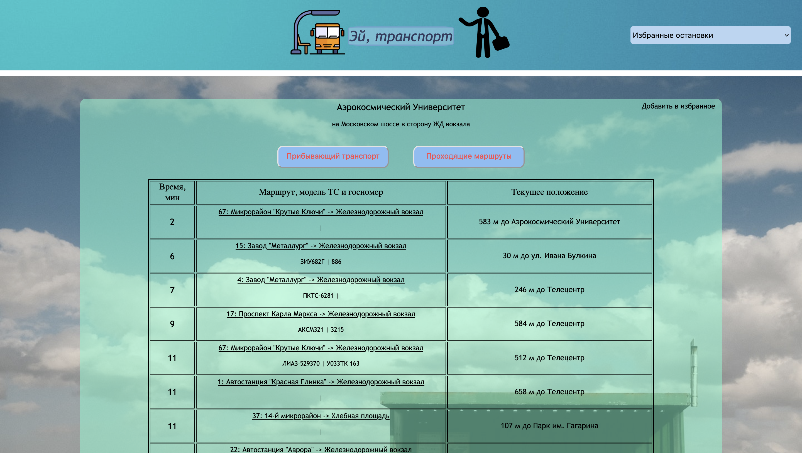
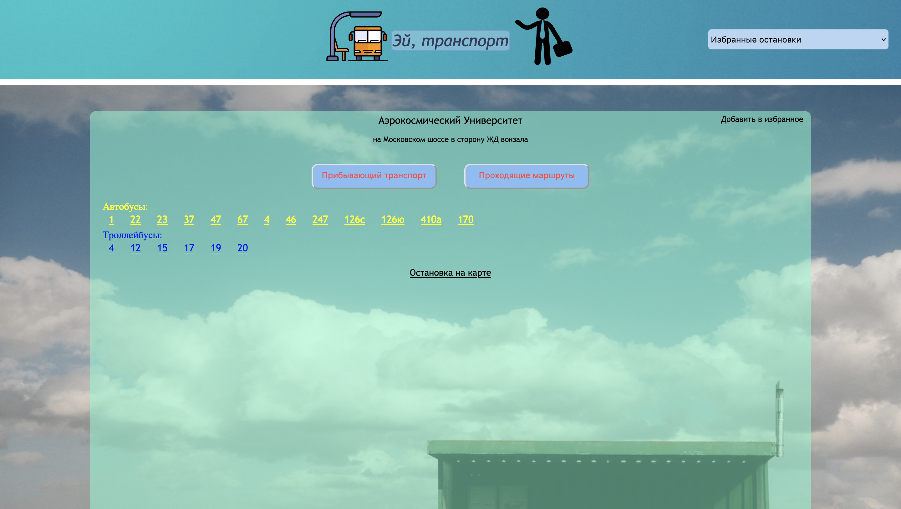
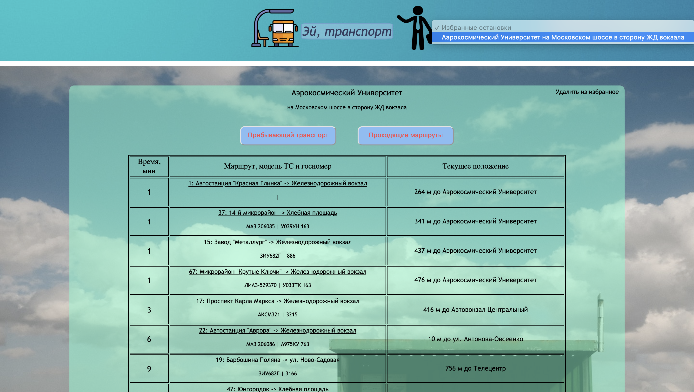

## Безопасность веб-приложений. Лабораторка №2

Сайт - аналог прибывалки, с функцией добавления остановок в избранные и функцией поиска по названию остановки.

### Запуск
1. Импортировать Python библиотеки из файла `requirements.txt`. (Это можно сделать с помощью команды: `pip install -r requirements.txt`)
2. Запустить приложение командой: `python start_site.py`

### Стартовая страница
Перейдя по адресу <http://127.0.0.1:5000/> (либо в терминале выведится другой адрес) в браузере, вы попадете на начальную страницу "прибывалки".

На стартовой странице мы можете найти остановку по названию или перейти к избранной остановке. Список избранных остановок расположен в верхнем правом углу.

### Страница остановки
Страница отображения выбранной вами остановки. На ней отображается прибывающий транспорт. В верхнем правом углу выделенной области расположена кнопка добавления/удаления остановки в список избранных остановок.

Вы можете увидеть и весь проходящий траспорт через эту остановку, нажав на кновку `Проходящий транспорт`.

Отображение избранных останов, после добавление текущей остановки в избранные

### Страница транспортного маршрута
На данной странице отображаются названия всех остановок, через которые проходит данный маршрут.